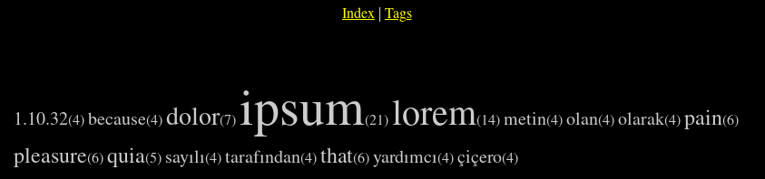

# Simple tag cloud project

Default url is [Lipsum](https://tr.lipsum.com/)

# Run

You can run without compile:

`go run main.go handler.go pageDatas.go tagParse.go`

# Build
If you want to build:

`go build main.go`

NOTE: If you build you still need to move tpl folder with binary!

# ScreenShot

